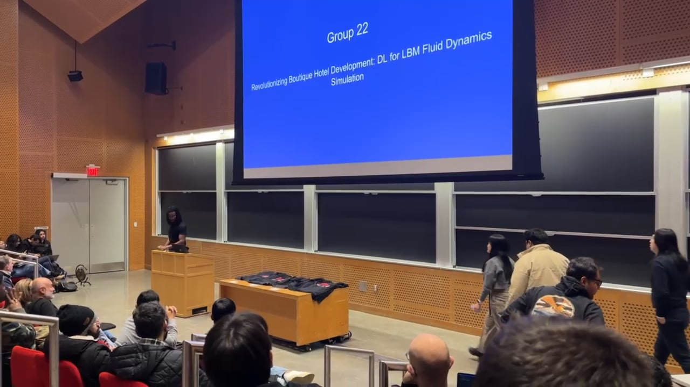

# Hotel CFD Optimization with ConvLSTM-LBM

**Project Overview:**

This project demonstrates an innovative approach to revolutionize fluid dynamics simulation in boutique hotel development. By leveraging a Convolutional LSTM (ConvLSTM) neural network architecture applied to the Lattice Boltzmann Method (LBM), we aim to optimize HVAC systems, thermal comfort, and building airflow, addressing the cost and efficiency challenges in hotel design.

## Executive Summary

The project presented at MIT's Introduction to Deep Learning course proposes an innovative approach to optimize fluid dynamics simulations for boutique hotel development, focusing on cost and efficiency in HVAC systems and building airflow. The initiative employs a Convolutional LSTM (ConvLSTM) neural network architecture that combines the capabilities of CNNs for spatial feature extraction with LSTMs for temporal dynamics, applied to the Lattice Boltzmann Method (LBM). This approach results in significantly faster computational times and lower memory requirements, providing predictions 10-100 times faster than traditional Computational Fluid Dynamics (CFD) methods. It tackles the financial burdens linked with design iterations, system optimization, and operational costs within a $10 million hotel project framework by offering real-time, physics-informed predictions, potentially leading to considerable savings and enhanced operational efficiency.

## Project Presentation

Watch the project presentation video to see our approach, methodology, and results:

## Slides

For a detailed look at the project through our slides:

- [Download Project Slides](slides/HotelCFD_Simulation_Slides.pdf)

## About the Project

- **Team**: Heidi Ongkowijaya, Eirwyn Zhang, Hamza Naeem, Khubaib Khan
- **Affiliation**: Cornell University, Carnegie Mellon University, Northeastern University, MIT Introduction to Deep Learning (6.S191)
- **Course Instructors**: Alexander Amini, Ava Amini
- **Project Focus**: Fluid Dynamics Simulation, Deep Learning, Hotel Development

## Acknowledgments

We extend our gratitude to guest lecturers Peter Grabowski and Maxime Labonne for their insights on LLMs; Douglas Blank for introducing us to the risks associated with AI project deployments; Ava Amini for her work at Microsoft Research; and John Werner for his support.

## Resources

- [Introduction to Deep Learning at MIT](https://introtodeeplearning.com/)
